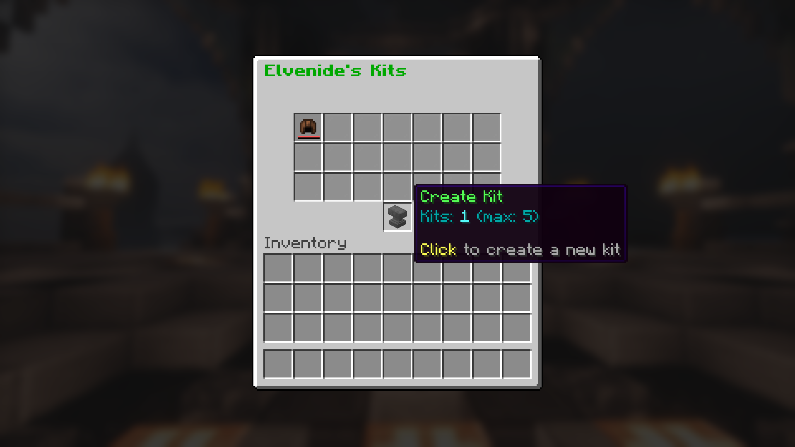
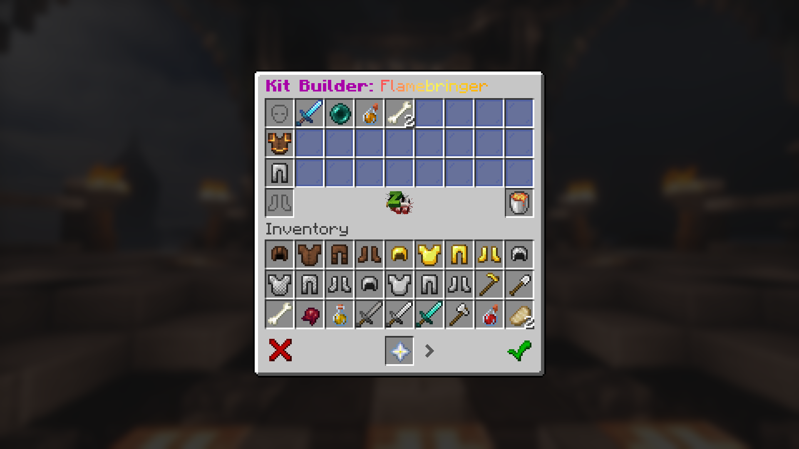
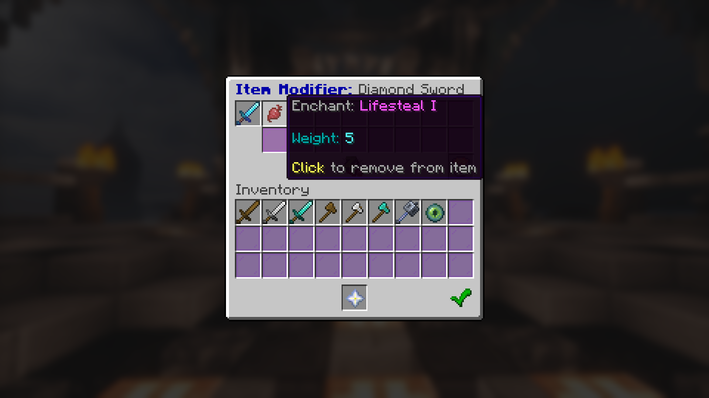
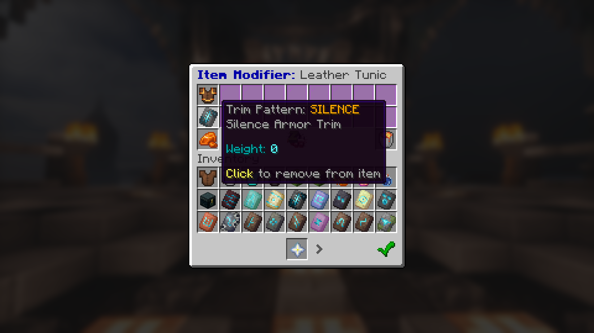
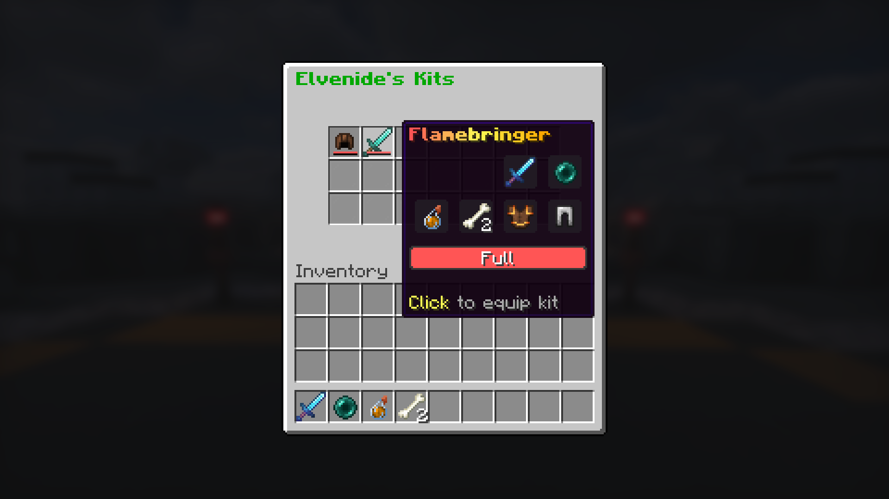
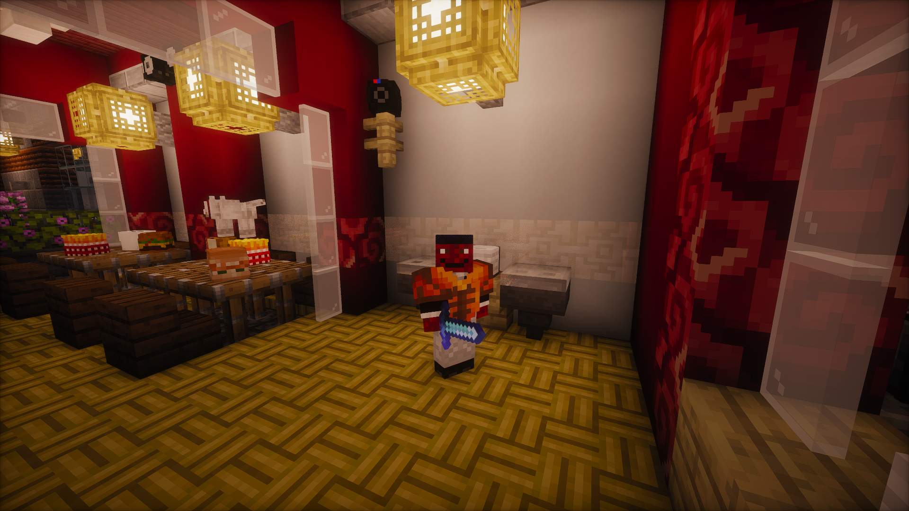
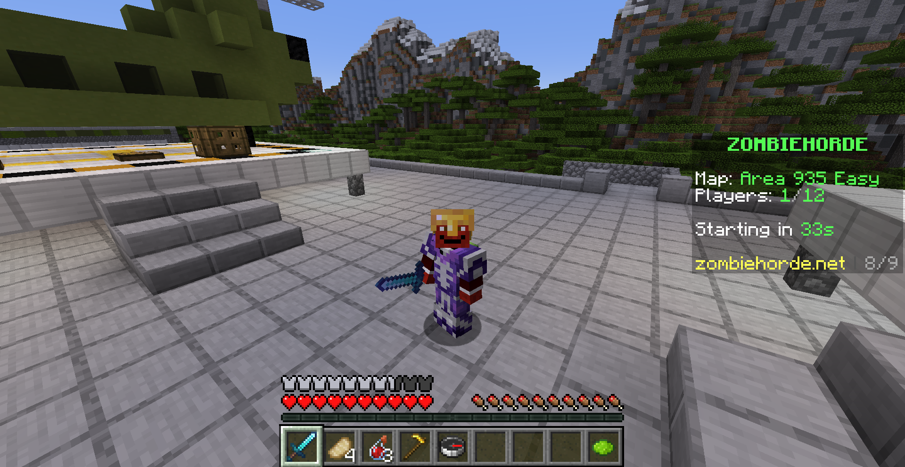

The update you've all been waiting for is finally here as of **Saturday, June 20th**!

This update features a new kit building system enabling you to thoroughly personalize your ZombieHorde experience. You can unlock more items/enchantments usable in the kit builder, the ability to add more items to your custom kits, and the ability to create more kits as you level up and prestige over time. Existing players will automatically unlock all items/enchantments for their current rank and prestige level, and premium items/enchantments associated with any premium kits they have bought.

All armor in the kit builder is **trimmable for free**, so you can vanquish the horde in style at no cost to your wallet or time.

In addition, there are **2 new items**, including a powerful weapon and a spawn egg for a cute but deadly companion. I don't want to spoil the surprise, so I'll let you discover them for yourself for now ;)

After this update, we will be moving towards smaller, more frequent update drops with new items, enemies, and mechanics that should make the server much more lively. I am also working on building a system that will making adding content much easier, so no more 6+ month wait for the next ZH update.

# Getting Started

To start creating a kit, right-click the chest item in your hotbar to open the kit menu. Click the anvil item to create a new kit.

Click items in the bottom menu to add them to your kit. Each item has an associated weight cost and other potential restrictions to prevent extremely OP kits. 

Left-click weapons and armors in the top menu that you've already added to the kit to add modifications to them (enchantments, armor trims). Trims are free, but enchantments have weight costs just like items. Normally illegal enchantment combinations such as smite and sharpness are allowed on a single item.

Once you've saved your kit, it's ready to be used. Join a game on any map, open the kit selector compass, and choose the kit that you built.

# Gallery

